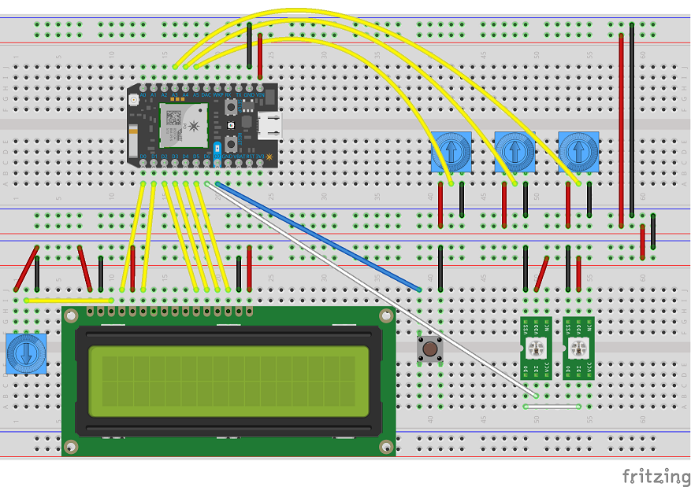

# color-dial

Real-time RGB and HSV color dial with NeoPixels and LCD display on a Particle Photon, with a real-time data feed to an Angular web app via Firebase.

Credit to [Joe Chasinga](https://github.com/jochasinga/firepot) for the [tutorial](https://medium.com/code-zen/intro-to-iot-with-arduino-firebase-and-angular-js-ea08c70f41ef) that originally inspired the Firebase interaction in this project.

